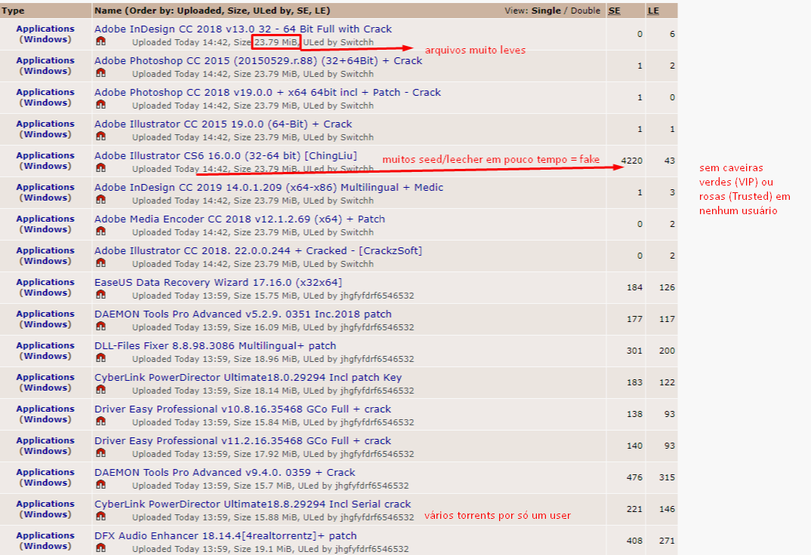

# Lista de Sites de Download v2.0
>Lista de sites/ferramentas piratas para o download de diversas coisas. discord danilo#8677

# INTRODUÇÃO
Antes de qualquer coisa, pelo amor de deus baixa o [uBlock Origin](https://github.com/gorhill/uBlock). Ele é uma extensão de navegador que bloqueia anúncios muito bem melhorado, mas serve também de anti-rastreador e anti-malware. Ele faz o trabalho bem melhor que outros bloqueadores e já me safei de muita coisa só por usar ele.
***USE O UBLOCK EM TODAS AS PÁGINAS APRESENTADAS.***
### Download:

 

       <a href="https://twitter.com/gorhill/status/1033706103782170625"><b>Desinstale</b> outros bloqueadores depois de instalar o uBlock</a>.

Recomendo fortemente dar uma olhada no jDownloader2 e no qBitTorrent que eu deixei ali embaixo nos variados.

## Sumário
- [Ferramentas](#ferramentas)
- [Séries e Filmes](#séries-e-filmes)
- [Jogos](#jogos)
- [ROMS](#roms)
- [De onde eu tirei tudo isso](#de-onde-eu-tirei-tudo-isso)

## Ferramentas
>coisas aleatórias seguras e sem vírus. alguns falsos-positivos mas dá nada

### Variados
- [AdAway](https://adaway.org/) - Bloqueador de anúncios pra celular que funciona no sistema inteiro. Funciona melhor com root, mas tem pra normal também.
- [jDownloader](http://jdownloader.org/jdownloader2) - Gerenciador de downloads (não é um acelerador) útil para baixar várias coisas ao mesmo tempo. Ele consegue atravessar os limites de download diários do Mega, por exemplo, e baixar basicamente qualquer elemento de um site.
- [qBitTorrent](https://www.qbittorrent.org/download.php) - Client de torrent muito bom, com um sistema de pesquisa incluso e uma interface limpa. **O UTORRENT E O BITTORRENT NÃO SÃO CONFIÁVEIS.**
- [WebTorrent](https://webtorrent.io/) - Programa útil para fazer o streaming de torrents, ou seja, assistir vídeos em torrent sem precisar baixar.
- [OneClickFirewall](https://winaero.com/comment.php?comment.news.1841) - Programa que possibilita bloquear o acesso a internet de um executável com um clique.
- [W3Schools](https://www.w3schools.com/) - Vários tutoriais de programação e desenvolvimento web gratuitos.
- [MetaStream](https://getmetastream.com/) - Extensão legal pra assistir coisas com amigos pelo discord. Suporta praticamente qualquer coisa
- [ProtonVPN](https://protonvpn.com/) - VPN grátis e boa, faz o que precisa fazer. O plano pago é meio carinho comparado a outras VPNs mas a gratuita é ótima.
- [rufus](https://rufus.ie/pt_BR/) - Útil pra criar pendrives com Windows/Linux para trocar ou reparar o sistema se você fizer caquinha.

### Cracks/Ativadores
- [MAS](https://github.com/massgravel/Microsoft-Activation-Scripts/releases) - Ferramenta ótima pra ativar o Windows e Office. Baixe e abra a versão All-in-One.
- [KMSpico](https://mega.nz/#F!DiJBwSKQ!QmdtN1HD8v8xQmkBI8gADg) - Alternativa ao MAS. Meio duvidoso, hoje em dia não recomendo muito mas usa se o MAS der pau.
- [AMTEmu](https://mega.nz/#F!Wug3HarT!Vh56AkrfxbYCGJ9Qal2I1Q) - Patcher universal dos programas da Adobe (CC 2014 a CC 2017).
- [GenP](https://drive.google.com/drive/folders/12smHql52DP-uv61E5tc8EKZUjhq6X2rW) - Patcher dos programas da Adobe CC 2019.

### Microsoft e Adobe
- [Windows ISO Downloader](https://www.heidoc.net/php/Windows-ISO-Downloader.exe) - Gerenciador de downloads das imagens intocadas do Windows e Office. Você ainda vai precisar de um crack.
- [TechBenz](https://tb.rg-adguard.net/public.php) - Similar ao acima, porém é um site e não um programa.
- [ProDesignTools](https://prodesigntools.com/adobe-cc-2018-direct-download-links.html) - Lista com download direto para os instaladores dos programas da Adobe, com todas as versões desde CS6 a CC 2019. Você ainda vai precisar de um crack e instruções. É possível acompanhar tutoriais no YouTube e usar os arquivos daqui.
- [Sjain_Guides](https://saidit.net/s/sjain_guides) - Guias, downloads e cracks dos produtos da Adobe CC 2018 e 2019 e Office 2019.
- [Plugins](https://pastebin.com/raw/5FHieQS0) - Pastebin com vários plugins pra After Effects e download do Sony Vegas Pro 16 e 14.

## Séries e Filmes
>pelo amor de deus baixa o ublock origin
- [Stremio](https://www.stremio.com/) - O Stremio é um programa de assistir séries e filmes a partir de torrents. Similar ao Popcorn Time, seu acervo é muito maior por conta de seu sistema de integração direta com os torrents de diversos sites e legendas automáticas em vários idiomas. Para aproveitar ao máximo dele, você deve instalar [essas extensões](http://prntscr.com/nezbkb) pelo próprio aplicativo. Com ele, é possível assistir basicamente qualquer mídia que estiver na internet e as legendas funcionam sempre. Agora também possui material dublado através da extensão que você acha no próprio aplicativo. Não dá pra baixar nada, mas como é tudo em torrent só procurar no 1337x ou thepiratebay (links na seção de jogos)
- [Plex](https://www.plex.tv/) - Serviço sensacional que organiza todos os filmes que você baixou, coloca informações e legenda automaticamente e sincroniza entre vários dispositivos. Isso quer dizer que se seu computador estiver ligado você pode assistir qualquer filme do seu computador na sua TV, celular ou na casa de alguém pela internet.
- [AnimesUp](https://animesup.net/) - Site de anime surpreendentemente bem feito, tem até botãozinho de pular abertura. Dá pra fazer download
- [SuperGratis](https://supergratis.biz) - Site de anime que o Orochi usava antigamente
- [BRanimes](https://www.branimes.com) - Outro site de anime
- [AnimesFalse](https://animesfalse.net/) - mais anime eeeeeba
- [Vizer](https://vizer.tv/) - Bom site para séries e filmes.
- [StreamCR](https://movies.org/) - Site americano com vários filmes e séries em inglês. Não possui legendas.

## Jogos
>só de PC, se quiser console/emulador vai pra seção de roms. ublock origin + jdownloader pfv
- [GOD](https://gog-games.com/) - Site com a grande maioria dos jogos do https://www.gog.com/ (loja de jogos), confíavel. Antes estava na Deep Web porque o dono tinha tomado exposed, mas voltou para a internet normal recentemente.
- [FitGirl](http://fitgirl-repacks.site/) - Site com instaladores da grande maioria dos jogos AAA, inclusive com tamanho reduzido. Esse site pega cracks já existentes e faz instaladores que pesam muito menos no HD (em alguns casos o jogo pesa somente 50% do tamanho normal), mas o instalador é bem lento e usa muitos recursos do computador. Faz também uploads no 1337x e no Rutor.
- [RarBG](https://rarbg.to/index37.php) - Site de torrent que upa os próprios torrents, tem todo tipo de coisa. Confiável se estiver baixando do usuario Scene (eles mesmos).
- [GamesTorrents](https://www.gamestorrents.io/) - Site em espanhol de torrents de jogos.
- [Rutor](http://rutor.info/) - Tracker russo com todo tipo de coisa e quase nunca tem vírus.
- [Gerador de Contas de Minecraft](https://fastalts.com/free-minecraft-generator/) - Não testei ainda e não me responsabilizo se o seu PC explodir
- [Outro gerador](https://mcleaks.net/) - Funciona de maneira diferente, também não testei ainda
- [Google Cloud Engine](https://www.youtube.com/watch?v=KDYGMS0Z3Rg) - Não é bem um jogo, é um guia de como fazer um server de Minecraft 24 horas sem lag nenhum pelo serviço de computação na nuvem da Google. Você vai precisar de um tempinho e vontade de aprender minimamente a mexer com Linux (mas sem instalar nada). Funciona por 3 meses antes que você tenha que repetir o processo em uma conta nova.
- [ThePirateBay](https://thepiratebay.org/) - Todo tipo de torrent, só baixar de usuarios com caveirinhas verdes ou roxas (deixe o usuário 'dauphong' em último caso, porém viável). Excelente para séries e filmes.
### Cuidado com torrents falsos.
Aqui, uma print com uma página inteira de torrents falsos e claramente vírus. Evite a todo custo.

- [1337x](https://1337x.to/) - Site de torrent com todo tipo de coisa similar ao TPB, porém sem garantia de que o link é seguro (deixe o usuário 'igggamescom' em último caso, porém viável). Bem mais confiável que o TPB. Uso ele pra qualquer coisa e nunca tive problema, mas existem se você sair baixando tudo.
  - No TPB e no 1337x qualquer um pode upar qualquer coisa, podendo ser vírus. O TPB possui um sistema de reputação (o das caveirinhas da print) e muito lixo, enquanto o 1337x no geral é muito mais limpo e confiável.
- [IGG-Games](https://igg-games.com/) e [sua versão torrent](https://pcgamestorrents.com/) - Última alternativa, se não achar algum jogo esse site o terá. O IGG tem uma fama de se envolver com polêmicas, como o fechamento de um site concorrente (o GOD mencionado anteriormente), injeção das próprias DRMs e vírus em seus downloads e anúncios abusivos em seu site. Isso também se aplica para os perfis 'igggamescom' no 1337x e 'dauphong' no TPB. Nem todos os downloads são inseguros, mas já é o suficiente para evitá-los. Se seu download possuir um arquivo .dll com o nome do site deles, utilize a ferramenta [fuckIGG](https://github.com/Pheeeeenom/fuckigg) para remover a dll com segurança.

## ROMS
>jogos antigos e emuladores
- [Megathread](https://r-roms.github.io/) - Lista (tipo essa aqui) com praticamente todos os jogos lançados depois do PS1. Recomendo procurar aqui antes das outras.
- [The Eye](http://the-eye.eu/public/rom/) - Vários jogos, para vários sistemas. Tem um acervo enorme (literalmente 400 jogos só com 'mario' no nome)
- [Vimm's Lair](https://vimm.net/?p=vault) - Outro site de ROMS, alternativa ao The Eye mas é bem lerdo.
- [DownloadRoms](https://www.downloadroms.io/) - Mais um site de ROMS, usei algumas vezes e tinha algumas páginas com conteúdo duvidoso mas não peguei vírus.
- [Roms Antigas](https://archive.org/download/No-Intro-Collection_2016-01-03_Fixed) - Site com um monte de roms de consoles antigos.

## De onde eu tirei tudo isso
>fontes de 80% besteirada, em inglês.
- [r/Piracy Megathread](https://www.reddit.com/r/piracy/wiki/megathread) - Wiki do subreddit de pirataria, com várias ferramentas e links úteis.
- [Begginers Guide to CrackWatch](https://www.reddit.com/r/CrackWatch/comments/7gyt85/crack_watch_beginners_guide_to_crack_watch/) - Informações sobre o download de jogos piratas, links e precauções.
- [Awesome Piracy](https://github.com/Igglybuff/awesome-piracy) - Similar à esse documento, mas em inglês e com muito mais informação.
